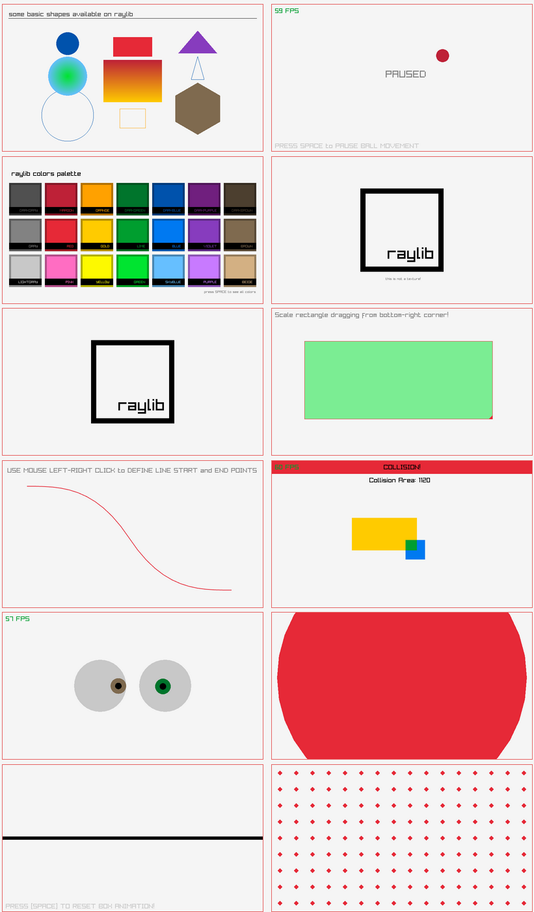
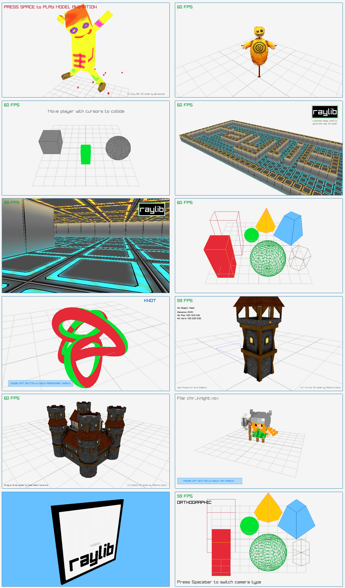
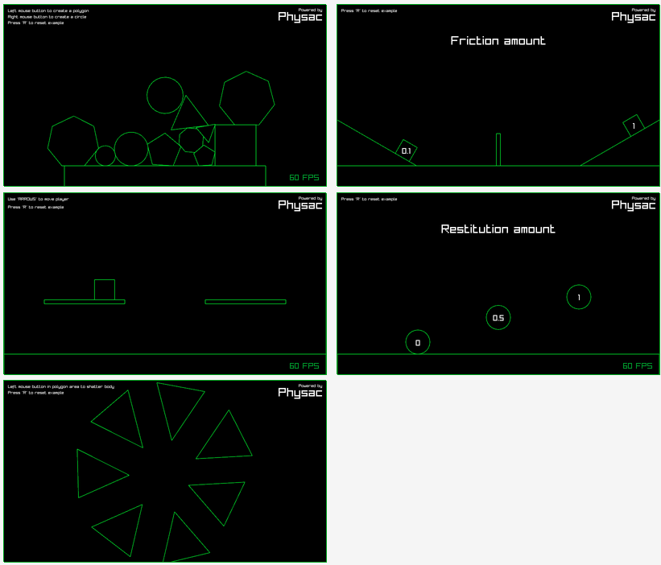
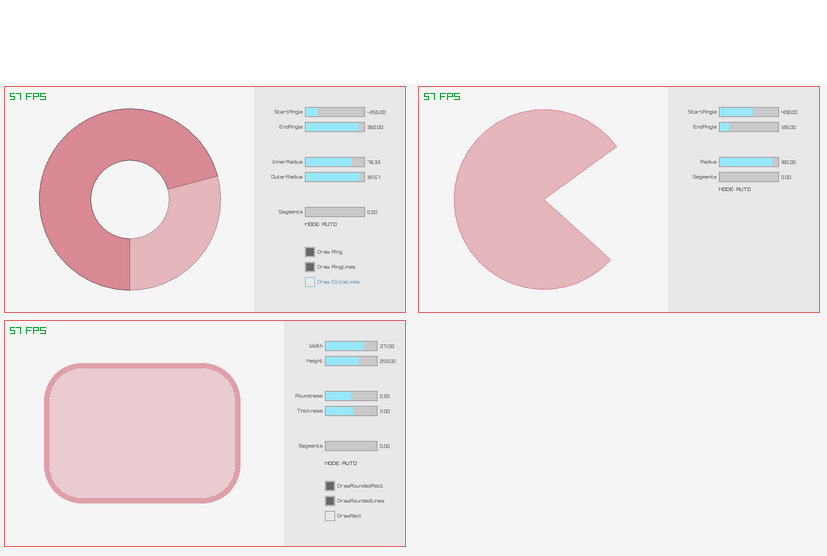

|  |
| ---------------------------------------------------------------------------------------------------- |

# Table of Contents
- [Table of Contents](#table-of-contents)
- [About](#about)
  - [Release timeline](#release-timeline)
    - [`RELEASE CANDIDATE`](#release-candidate)
    - [`RELEASE`](#release)
- [Examples](#examples)
- [Differences from `Raylib-Cs`](#differences-from-raylib-cs)
- [Usage Tips / FAQ](#usage-tips--faq)
- [Known Issues:](#known-issues)
- [How to Contribute](#how-to-contribute)
- [ChangeLog](#changelog)

# About
Precise, minimal bindings to `Raylib v4` and `Raylib v4 Extras`.  Convenience wrappers are added to make it easy to work with.
- Includes bindings for `RayGui`, `Easings`, `Physac`, `RlGl`, `RayMath`.
- Tested and verified via more than 100 examples (**ALL** Raylib examples ported).  These [examples are available to you in the GitHub Repo](https://github.com/NotNotTech/Raylib-CsLo/tree/main/Raylib-CsLo.Examples)
-    Requires `unsafe` for 3d workflows.
-    Requires `net6.0`
-    Tested on `Win10`.  Please test on other platforms and [raise an issue](https://github.com/NotNotTech/Raylib-CsLo/issues) if any problems occur.
- A focus on performance.  No runtime allocations if at all possible.
- No intellisense docs. [read the raylib cheatsheet for docs](https://www.raylib.com/cheatsheet/cheatsheet.html) or [view the examples](https://github.com/NotNotTech/Raylib-CsLo/tree/main/Raylib-CsLo.Examples)

## Release timeline

### `RELEASE CANDIDATE`
- **The current status.**
- All Raylib features, including Extras bindings
  - `raylib` : Core features, including Audio.
  - `rlgl` : OpenGl abstraction
  - `raygui` : A Imperitive Gui
  - `physac` : A 2d physics framework
  - `easings` : for simple animations  (Managed Port)
  - `raymath` : game math library (Managed Port)
- All raylib examples are ported and working (see the github repository for the example project)
- [A Nuget package is avalable](https://www.nuget.org/packages/Raylib-CsLo)

### `RELEASE`
- Triggered a few weeks after the last RC issue is fixed. If you find any bugs with the release candidate, be sure to [raise an issue](https://github.com/NotNotTech/Raylib-CsLo/issues)!

# Examples
Here are links to most the examples.  The images/links probably won't work from Nuget.  [Visit the Github Repo to see it properly.](https://github.com/NotNotTech/Raylib-CsLo)

| [`Core`](./Raylib-CsLo.Examples/Core/)                                                 | [`Shapes`](./Raylib-CsLo.Examples/Shapes/)                                                   | [`Textures`](./Raylib-CsLo.Examples/Textures/)                                                     | [`Text`](./Raylib-CsLo.Examples/Text/)                                                 | [`Models`](./Raylib-CsLo.Examples/Models/)                                                   | [`Shaders`](./Raylib-CsLo.Examples/Shaders/)                                                    | [`Audio`](./Raylib-CsLo.Examples/Audio/)                                                  | [`Physics`](./Raylib-CsLo.Examples/Physics/)                                                    |
| -------------------------------------------------------------------------------------- | -------------------------------------------------------------------------------------------- | -------------------------------------------------------------------------------------------------- | -------------------------------------------------------------------------------------- | -------------------------------------------------------------------------------------------- | ----------------------------------------------------------------------------------------------- | ----------------------------------------------------------------------------------------- | ----------------------------------------------------------------------------------------------- |
|  |  |  |  |  |  |  |  |
|  |  |  |     |  |  |     |     |

# Differences from `Raylib-Cs`

| [`Raylib-Cs`](https://github.com/ChrisDill/Raylib-cs)               | `Raylib-CsLo`                                                                                                                                                                     |
| ------------------------------------------------------------------- | --------------------------------------------------------------------------------------------------------------------------------------------------------------------------------- |
| Each binding is hand crafted with carefull design                   | Exact Bindings (Autogen) with wrappers to make C# usage nice.                                                                                                                     |
| Bindings for `Raylib` and extras `RayMath`, `RlGl`.                 | Bindings for `Raylib` and all extras (`RayGui`, `Easings`, `Physac`, `RlGl`, `RayMath`)                                                                                           |
| Optimized for normal C# usage                                       | Optimized for maximum performance and requires `unsafe`                                                                                                                           |
| New Raylib version? Harder to detect breaking changes               | New Raylib version? Breaking changes are easy to spot and fix                                                                                                                     |
| includes Intellisence docs                                          | No docs.  Use the [Cheatsheet](https://www.raylib.com/cheatsheet/cheatsheet.html) /          [Examples](https://github.com/NotNotTech/Raylib-CsLo/tree/main/Raylib-CsLo.Examples) |
| has a long track record                                             | didn't exist till mid november 2021!                                                                                                                                              |
| [Lots of examples](https://github.com/ChrisDill/Raylib-cs-Examples) | [ALL Raylib examples](https://github.com/NotNotTech/Raylib-CsLo/tree/main/Raylib-CsLo.Examples)                                                                                   |
| zlib licensed                                                       | lgpl licensed                                                                                                                                                                     |
| [Nuget Package](https://www.nuget.org/packages/Raylib-cs/)          | [Nuget Package](https://www.nuget.org/packages/Raylib-CsLo)                                                                                                                       |
| raylib 3.7.1 Stable                                                 | Raylib 4.0.0                                                                                                                                                                      |
| lots of contribs                                                    | just little 'ol me                                                                                                                                                                |

# Usage Tips / FAQ
- **Does `Raylib-CsLo` include the `SOME_FUNCTION_YOU_NEED()` function?**
  - Raylib-CsLo has bindings for everything in the Raylib 4.0 release, including extras like `raygui` and `physac`, but with the exception of things in the `Known Issues` section further below.
- **Why didn't you add a wrapper for function `SOME_OTHER_FUNCTION_YOU_NEED()`?** 
  - Raylib-CsLo uses a manual marshalling technique, as the built in PInvoke marshalling is not very efficienct.  Unfortunately writing wrappers takes time.
  - I am going through all the examples and porting them, and when I do I'm adding wrappers to the raylib api's used (I'm using examples as a heuristic for "commonly used api's)   For a function I haven't written a wrapper for, you can look at how I do it and write your own wrapper, or can help the project by submitting a PR.  
  - On average it only takes me about 15 min to port each example, but there are many examples.
- **How do I convert a string to `sbyte*` or vice-versa?**
  - Look if there is a wrapper overload you can call.  If not, you can write your own wrapper by coppying the pattern in one of the existing wrappers.
- **Do I have to really cast my Enum to `int`?**
  -  The autogen bindings are left untouched, however convenience wrappers are added.  Usually these will automagically "work" via function overloads, but where this is not possible, try adding an underscore `_` to the end of the function/property.  For example:  `Camera3D.projection_ = CameraProjection.CAMERA_ORTHOGRAPHIC;` or `Gesture gesture = Raylib.GetGestureDetected_();`
- **I ran the examples in a profiler.   What are all these `sbyte[]` arrays being allocated?**
   -  A pool of `sbyte[]` is allocated for string marshall purposes, to avoid runtime allocations.
- **Why don't you add wrappers for the Math helpers?**
  - The `RayMath` helper functions have been translated into C# code.   This is because crossing between Managed and Native code isn't free.  Better you do all your maths in managed code, and pass the final result to raylib.
- **Why are my matricies corrupt?**
  - Raylib/OpenGl uses column-major matricies, while dotnet/vulkan/directx uses row-major.  When passing your final calculated matrix to raylib for rendering, call `Matrix4x4.Transpose(yourMatrix)`

# Known Issues:
- `RayGui`: be sure to call `RayGui.GuiLoadStyleDefault();` right after you `InitWindow()`.  This is needed to initialize the gui properly.  If you don't, if you close a raylib window and then open a new one (inside the same app), the gui will be broken.
- The `Text.Unicode` example doesn't render unicode properly.  Maybe the required font is missing, maybe there is a bug in the example (Utf16 to Utf8 conversion) or maybe there is a bug in Raylib.  A hunch: I think it's probably due to the fonts not including unicode characters, but I didn't investigate further.
-  Native Memory allocation functions:  use `System.Runtime.InteropServices.NativeMemory.Alloc()` instead
-  `LogCustom()` is ported but doesn't support variable length arguments.

# How to Contribute

0) assume you are using Visual Studio (or maybe rider?) and can run `dev.sln`
1) fork the repo, build and try out the example project
2) ???  improve the wrappers?    All features are done and working 😎

| ~ example group ~ | ~ who is doing port ~ | ~ done? ~ |
| ----------------- | --------------------- | --------- |
| core              | novaleaf              | [X]       |
| shapes            | novaleaf              | [X]       |
| textures          | novaleaf              | [X]       |
| text              | novaleaf              | [X]       |
| models            | novaleaf              | [X]       |
| shaders           | novaleaf              | [X]       |
| audio             | novaleaf              | [X]       |
| physics           | novaleaf              | [X]       |

# ChangeLog
- **4.0.0-rc.0.1** (2021/11/23):  Pretty things up.
- **4.0.0-rc.0** (2021/11/22):  `physac.dll` and bindings for it added.  `Physics` and `Audio` examples ported.   All `raylib` examples complete!
- **4.0.0-beta.2** (2021/11/22):  `RayGui`, and `Easings` Raylib.extras ported to managed code. `Shapes`,`Textures`, and `Text` examples ported.
- **4.0.0-beta.0** (2021/11/20):  `Model`, and `Shader` examples ported. 
- **4.0.0-alpha.2** (2021/11/18):  Model examples ported. AutoGen Bindings expanded to include all api's exposed by Raylib.dll (adding `RayMath`, `RlGl`)
- **4.0.0-alpha.1** (2021/11/16):  all `Core` examples ported, so "feature complete" for the workflows used in those examples (and, complete only for those workflows)
