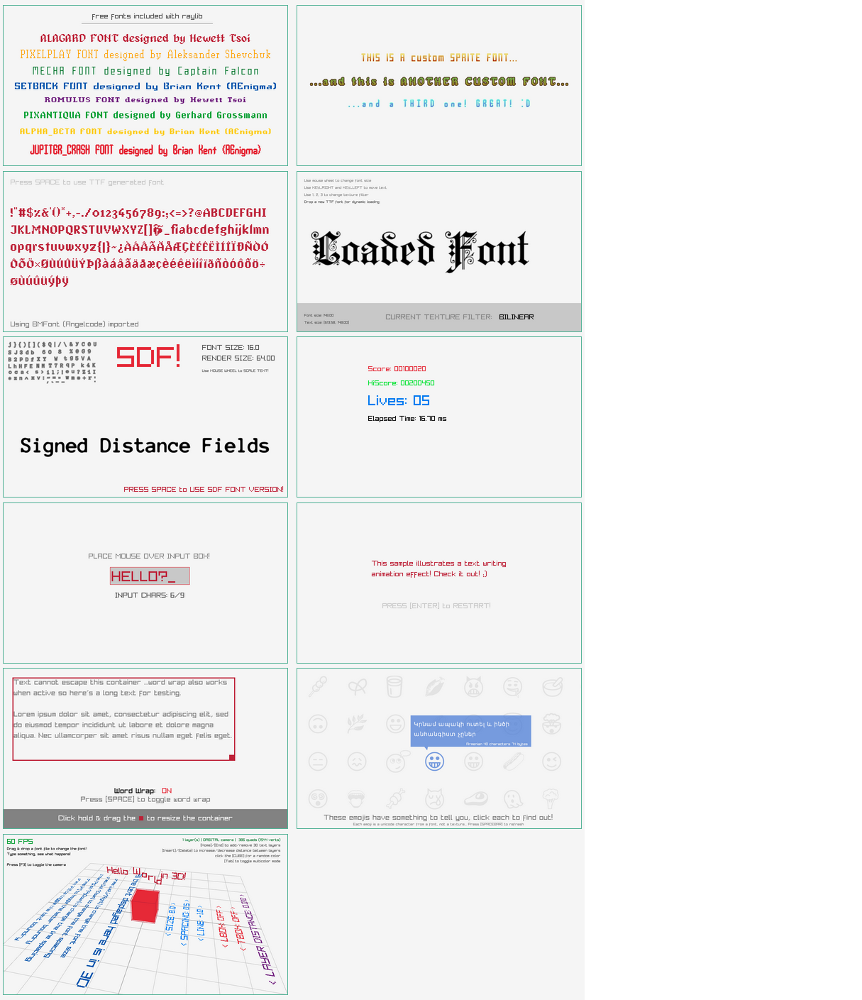
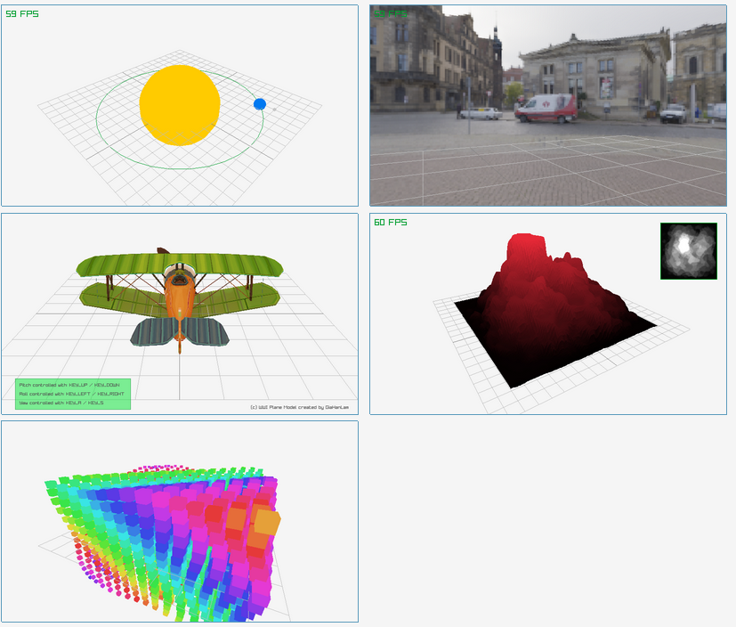
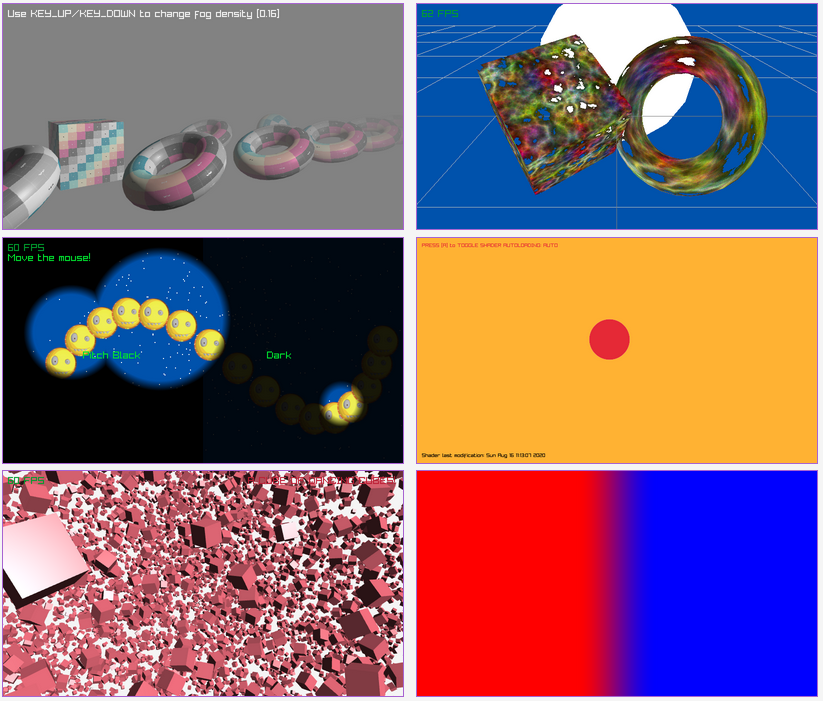

| [](https://github.com/NotNotTech/Raylib-CsLo) |
| ------------------------------------------------------------------------------------------------------------------------------------------------------------------ |


[](https://www.nuget.org/packages/Raylib-CsLo)
[](https://github.com/NotNotTech/Raylib-CsLo)
[](https://github.com/NotNotTech/Raylib-CsLo/tree/main/Raylib-CsLo.Examples)

[](https://discord.gg/raylib)
# Table of Contents
- [Table of Contents](#table-of-contents)
- [About](#about)
  - [What is **Raylib**?](#what-is-raylib)
  - [Super easy to use for 2d!](#super-easy-to-use-for-2d)
  - [High performance for 3d!  (but `unsafe` to use)](#high-performance-for-3d--but-unsafe-to-use)
- [How to use/install](#how-to-useinstall)
  - [via Nuget](#via-nuget)
  - [via sources](#via-sources)
- [Linux / OsX / other platform support](#linux--osx--other-platform-support)
- [Release timeline](#release-timeline)
  - [`RELEASE CANDIDATE`](#release-candidate)
  - [`RELEASE`](#release)
- [Examples](#examples)
- [Differences from `Raylib-Cs`](#differences-from-raylib-cs)
- [Usage Tips / FAQ](#usage-tips--faq)
- [Known Issues:](#known-issues)
- [How to Contribute](#how-to-contribute)
- [ChangeLog](#changelog)
- [Todo](#todo)


# About
Managed C# bindings to `Raylib`, a friendly 2d/3d game framework similar to XNA / MonoGame.
- Win/Linux/OsX supported.
- Includes bindings for raylib extras: `RayGui`, `Easings`, `Physac`, `RlGl`, `RayMath`.
- Minimal bindings + convenience wrappers to make it easier to use.
- Tested and verified **ALL** 100+ Raylib examples.  These [ported examples are available to you in the GitHub Repo](https://github.com/NotNotTech/Raylib-CsLo/tree/main/Raylib-CsLo.Examples)
-    Requires `unsafe` for 3d workflows.
-    Requires `net6.0` (net5.0 isn't enough)
-    Tested on `Win10`.  User Reports `Arch` Linux works.  Please test on other platforms and [raise an issue](https://github.com/NotNotTech/Raylib-CsLo/issues) if any problems occur.
- A focus on performance.  No runtime allocations if at all possible.
- No intellisense docs. [read the raylib cheatsheet for docs](https://www.raylib.com/cheatsheet/cheatsheet.html) or [view the examples](https://github.com/NotNotTech/Raylib-CsLo/tree/main/Raylib-CsLo.Examples)
- Full source code included in [The GitHub Repository](https://github.com/NotNotTech/Raylib-CsLo), including native sources, allowing you to compile for any platform you wish.

## What is **Raylib**?
[Raylib](https://www.raylib.com/) is a friendly-to-use game framework that includes basic scenarios to meet your needs:   audio, 2d, 3d, fonts, animation, 2d physics.  Somewhat similar to `Xna` or `MonoGame` but friendlier.  **However, `Raylib` is a C/CPP framework**.  `Raylib-CsLo` is a C# Wrapper over the top, which lets you gain raylib's powers to quickly prototype your game ideas.

## Super easy to use for 2d!
If you stick with 2d, you don't need to use any `unsafe` (pointer) code, which lets 2d users feel at home and use `Raylib-CsLo` as an awesome 2d game framework.   

## High performance for 3d!  (but `unsafe` to use)
If you use 3d, you need to understand a bit of how pointers work. Raylib uses these to link things like `Model`, `Mesh`, and `Material`.  Writing wrappers over these is possible but it would basically be creating a an entirely new framework.  I suggest leaving this as-is, as it avoids object allocation (GC Pressure).

Additionally, 3d users: **Be sure you check the Usage Tips section below**, especially on how you need to use `Matrix4x4.Transpose()` when sending matricies to Raylib.

# How to use/install
## via Nuget
1. add the latest version of [The Raylib-CsLo Nuget Package](https://www.nuget.org/packages/Raylib-CsLo) to your project
2. Create an example project using it, the following code is coppied from [The StandAlone Example's Program.cs](https://github.com/NotNotTech/Raylib-CsLo/tree/main/StandaloneExample/program.cs)
```cs
using Raylib_CsLo;

namespace StandaloneExample
{
	public static class Program
	{
		public static async Task Main(string[] args)
		{
			Raylib.InitWindow(1280, 720, "Hello, Raylib-CsLo");
			Raylib.SetTargetFPS(60);
			// Main game loop
			while (!Raylib.WindowShouldClose()) // Detect window close button or ESC key
			{
				Raylib.BeginDrawing();
				Raylib.ClearBackground(Raylib.SKYBLUE);
				Raylib.DrawFPS(10, 10);
				Raylib.DrawText("Raylib is easy!!!", 640 , 360, 50, Raylib.RED);
				Raylib.EndDrawing();
			}
			Raylib.CloseWindow();
		}
	}
}
```
## via sources
1. clone/download the [github repository](https://github.com/NotNotTech/Raylib-CsLo)
2. open `./Raylib-CsLo-DEV.sln` in Visual Studio 2022.
3. build and run.
   - the `Raylib-CsLo.Examples` project will run by default, and will run through all (aprox 100+) examples.
4. For a stand-alone example that uses the Nuget Package, see the [`./StandaloneExample` folder](https://github.com/NotNotTech/Raylib-CsLo/tree/main/StandaloneExample)

# Linux / OsX / other platform support

The following platforms are shipped in the nuget package:
- `win-x64` : confirmed working on `Win10, x64`.  This is the platform used for dev/testing of `raylib-cslo`.
- `linux-x64`: confirmed working on `Arch` Linux.  Binaries built under `Ubuntu 20.04` so that shold also work.
- `osx-x64`:  not confirmed yet.  Please let me know if you try.

You can build the native binaries for whatever platform you need.  Please see the readme under https://github.com/NotNotTech/Raylib-CsLo/tree/main/Raylib-CsLo/runtimes for more info.


# Release timeline

## `RELEASE CANDIDATE`
- **The current status.**
- All Raylib features, including Extras bindings
  - `raylib` : Core features, including Audio.
  - `rlgl` : OpenGl abstraction
  - `raygui` : An Imperitive Gui
  - `physac` : A 2d physics framework
  - `easings` : for simple animations  (Managed Port)
  - `raymath` : game math library (Managed Port)
- All raylib examples are ported and working (see the github repository for the example project)
- [A Nuget package is avalable](https://www.nuget.org/packages/Raylib-CsLo)

## `RELEASE`
- Triggered a few weeks after the last RC issue is fixed. If you find any bugs with the release candidate, be sure to [raise an issue](https://github.com/NotNotTech/Raylib-CsLo/issues)!


# Examples
Here are links to most the examples.  The images/links probably won't work from Nuget.  [Visit the Github Repo to see it properly.](https://github.com/NotNotTech/Raylib-CsLo)

| [`Core`](./Raylib-CsLo.Examples/Core/)                                                 | [`Shapes`](./Raylib-CsLo.Examples/Shapes/)                                                   | [`Textures`](./Raylib-CsLo.Examples/Textures/)                                                     | [`Text`](./Raylib-CsLo.Examples/Text/)                                                 | [`Models`](./Raylib-CsLo.Examples/Models/)                                                   | [`Shaders`](./Raylib-CsLo.Examples/Shaders/)                                                    | [`Audio`](./Raylib-CsLo.Examples/Audio/)                                                  | [`Physics`](./Raylib-CsLo.Examples/Physics/)                                                    |
| -------------------------------------------------------------------------------------- | -------------------------------------------------------------------------------------------- | -------------------------------------------------------------------------------------------------- | -------------------------------------------------------------------------------------- | -------------------------------------------------------------------------------------------- | ----------------------------------------------------------------------------------------------- | ----------------------------------------------------------------------------------------- | ----------------------------------------------------------------------------------------------- |
| [](./Raylib-CsLo.Examples/Core) | [](./Raylib-CsLo.Examples/Shapes) | [](./Raylib-CsLo.Examples/Textures) | [](./Raylib-CsLo.Examples/Text) | [](./Raylib-CsLo.Examples/Models) | [](./Raylib-CsLo.Examples/Shaders) | [](./Raylib-CsLo.Examples/Audio) | [](./Raylib-CsLo.Examples/Physics) |
| [](./Raylib-CsLo.Examples/Core) | [](./Raylib-CsLo.Examples/Shapes) | [](./Raylib-CsLo.Examples/Textures) | [](./Raylib-CsLo.Examples/Text)    | [](./Raylib-CsLo.Examples/Models) | [](./Raylib-CsLo.Examples/Shaders) | [](./Raylib-CsLo.Examples/Audio)    | [](./Raylib-CsLo.Examples/Physics)    |

# Differences from `Raylib-Cs`

| [`Raylib-Cs`](https://github.com/ChrisDill/Raylib-cs)               | `Raylib-CsLo`                                                                                                                                                                     |
| ------------------------------------------------------------------- | --------------------------------------------------------------------------------------------------------------------------------------------------------------------------------- |
| Each binding is hand crafted with carefull design                   | Exact Bindings (Autogen) with wrappers to make C# usage nice.                                                                                                                     |
| Bindings for `Raylib` and extras `RayMath`, `RlGl`.                 | Bindings for `Raylib` and all extras (`RayGui`, `Easings`, `Physac`, `RlGl`, `RayMath`)                                                                                           |
| Optimized for normal C# usage                                       | Optimized for maximum performance and requires `unsafe`                                                                                                                           |
| New Raylib version? Harder to detect breaking changes               | New Raylib version? Breaking changes are easy to spot and fix                                                                                                                     |
| includes Intellisence docs                                          | No docs.  Use the [Cheatsheet](https://www.raylib.com/cheatsheet/cheatsheet.html) /          [Examples](https://github.com/NotNotTech/Raylib-CsLo/tree/main/Raylib-CsLo.Examples) |
| has a long track record                                             | didn't exist till mid november 2021!                                                                                                                                              |
| [Lots of examples](https://github.com/ChrisDill/Raylib-cs-Examples) | [ALL 100+ Raylib examples](https://github.com/NotNotTech/Raylib-CsLo/tree/main/Raylib-CsLo.Examples)                                                                              |
| zlib licensed                                                       | lgpl licensed                                                                                                                                                                     |
| [Nuget Package](https://www.nuget.org/packages/Raylib-cs/)          | [Nuget Package](https://www.nuget.org/packages/Raylib-CsLo)                                                                                                                       |
| raylib 3.7.1 Stable                                                 | Raylib 4.0.0                                                                                                                                                                      |
| lots of contribs                                                    | just little 'ol me                                                                                                                                                                |


# Usage Tips / FAQ
- **How do I do `SOME_IDEA`?**
  - All the Raylib examples (100+) have been ported successfully.  Please refer to them here: [ALL 100+ Raylib examples](https://github.com/NotNotTech/Raylib-CsLo/tree/main/Raylib-CsLo.Examples).  If you need more help, ask on Discord.
- **Does `Raylib-CsLo` include the `SOME_FUNCTION_YOU_NEED()` function?**
  - Raylib-CsLo has bindings for everything in the Raylib 4.0 release, including extras like `raygui` and `physac`, but with the exception of things in the `Known Issues` section further below.
- **Why didn't you add a wrapper for function `SOME_OTHER_FUNCTION_YOU_NEED()`?** 
  - Raylib-CsLo uses a manual marshalling technique, as the built in PInvoke marshalling is not very efficienct.  Most API's have wrappers (and all involving `string` marshalling), but some involving pointers have been left as-is.  If you come across a function that you feel needs more wrapping, you can [raise an issue](https://github.com/NotNotTech/Raylib-CsLo/issues) or perhaps [submit a PR](https://github.com/NotNotTech/Raylib-CsLo/pulls)
- **How do I convert a string to `sbyte*` or vice-versa?**
  - All API's that take `sbyte*` have `string` wrappers, so be sure to look at the overload you can call.
- **Do I have to really cast my Enum to `int`?**
  -  The autogen bindings are left untouched, however convenience wrappers are added.  Usually these will automagically "work" via function overloads, but where this is not possible, try adding an underscore `_` to the end of the function/property.  For example:  `Camera3D.projection_ = CameraProjection.CAMERA_ORTHOGRAPHIC;` or `Gesture gesture = Raylib.GetGestureDetected_();`.
  -  If all else fails, yes.  Cast to `(int)`.
- **I ran the examples in a profiler.   What are all these `sbyte[]` arrays being allocated?**
   -  A pool of `sbyte[]` is allocated for string marshall purposes, to avoid runtime allocations.
- **Can I, Shoudl I use `RayMath`?**
  - `Raylib_CsLo.RayMath` contains a lot of super helpful functions for doing gamedev related maths.
  - The `RayMath` helper functions have been translated into C# code.   This makes the code pretty fast, but if the same function exists under `System.Numerics` you should use that instead, because the DotNet CLR treats things under System.Numerics speciall, and optimizes it better.
- **Why are my matricies corrupt?**
  - Raylib/OpenGl uses column-major matricies, while dotnet/vulkan/directx uses row-major.  When passing your final calculated matrix to raylib for rendering, call `Matrix4x4.Transpose(yourMatrix)`

# Known Issues:
- `RayGui`: be sure to call `RayGui.GuiLoadStyleDefault();` right after you `InitWindow()`.  This is needed to initialize the gui properly.  If you don't, if you close a raylib window and then open a new one (inside the same app), the gui will be broken.
- The `Text.Unicode` example doesn't render unicode properly.  Maybe the required font is missing, maybe there is a bug in the example (Utf16 to Utf8 conversion) or maybe there is a bug in Raylib.  A hunch: I think it's probably due to the fonts not including unicode characters, but I didn't investigate further.
-  Native Memory allocation functions are not ported:  use `System.Runtime.InteropServices.NativeMemory.Alloc()` instead
-  `LogCustom()` is ported but doesn't support variable length arguments.

# How to Contribute

0) assume you are using Visual Studio (or maybe rider?) and can run `dev.sln`
1) fork the repo, build and try out the example project
2) Pick something to do
  - test/improve support on linux and/or OsX
  - improve wrappers for ease of use
  - ????  check issues


# ChangeLog
- **4.0.0-rc.3** (2021/11/29):  No breaking changes.  Improve Boolean Marshalling.  
- **4.0.0-rc.2** (2021/11/28):  Rollup all native code into single binary.  Improve bindings compat.  
- **4.0.0-rc.1** (2021/11/24):  Support for Linux and OsX (hopefully).
- **4.0.0-rc.0.1** (2021/11/23):  Pretty things up.
- **4.0.0-rc.0** (2021/11/22):  `physac.dll` and bindings for it added.  `Physics` and `Audio` examples ported.   All `raylib` examples complete!
- **4.0.0-beta.2** (2021/11/22):  `RayGui`, and `Easings` Raylib.extras ported to managed code. `Shapes`,`Textures`, and `Text` examples ported.
- **4.0.0-beta.0** (2021/11/20):  `Model`, and `Shader` examples ported. 
- **4.0.0-alpha.2** (2021/11/18):  Model examples ported. AutoGen Bindings expanded to include all api's exposed by Raylib.dll (adding `RayMath`, `RlGl`)
- **4.0.0-alpha.1** (2021/11/16):  all `Core` examples ported, so "feature complete" for the workflows used in those examples (and, complete only for those workflows)


# Todo
- soonish
  - Improve XPlat:
    - *pending.  will aim to have native binaries generated via github actions...*
  - exit pre-release
- later
  
  

<!-- [](https://github.com/NotNotTech/Raylib-CsLo/graphs/contributors) -->